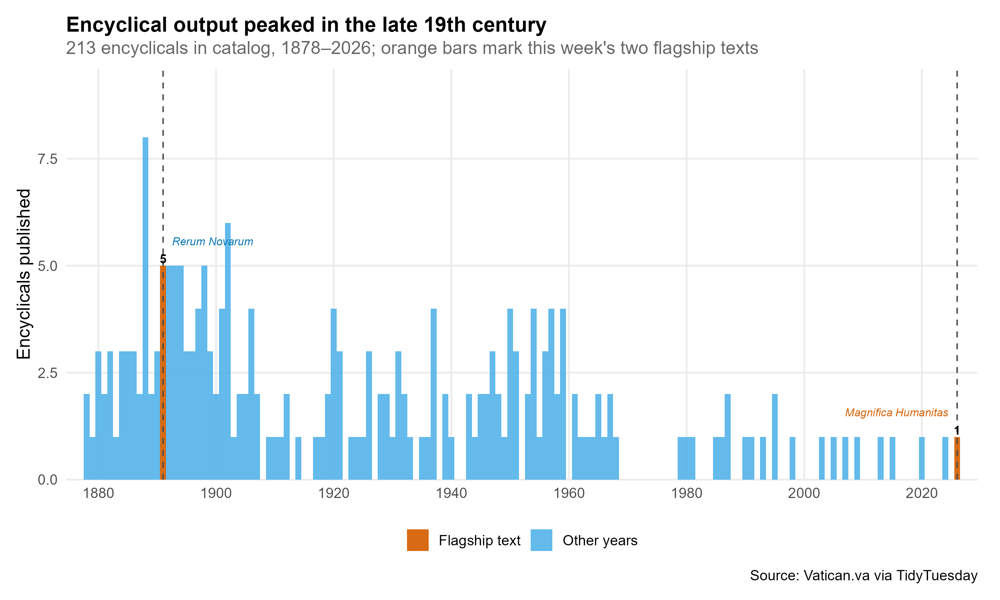
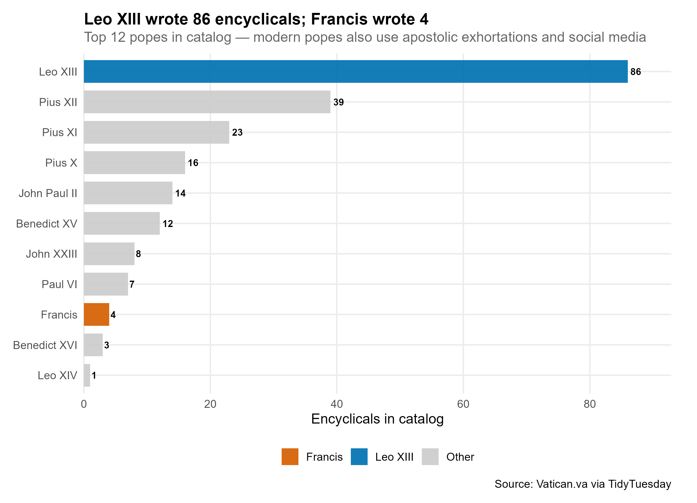
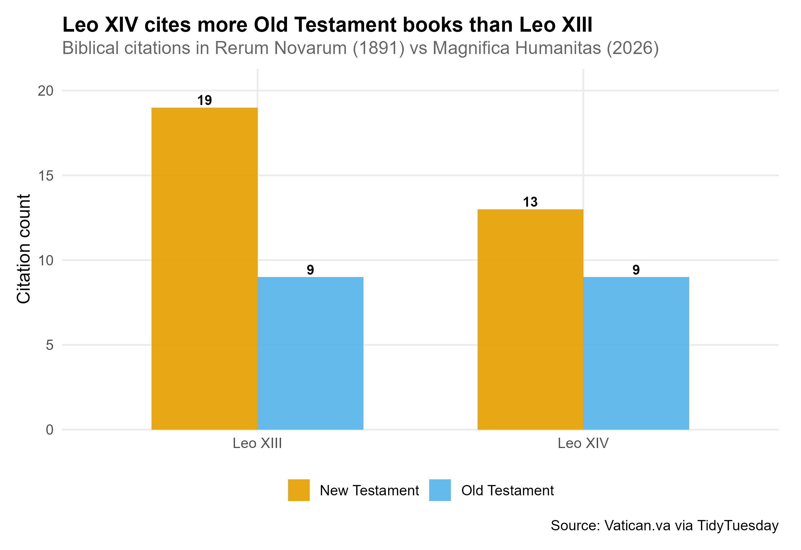
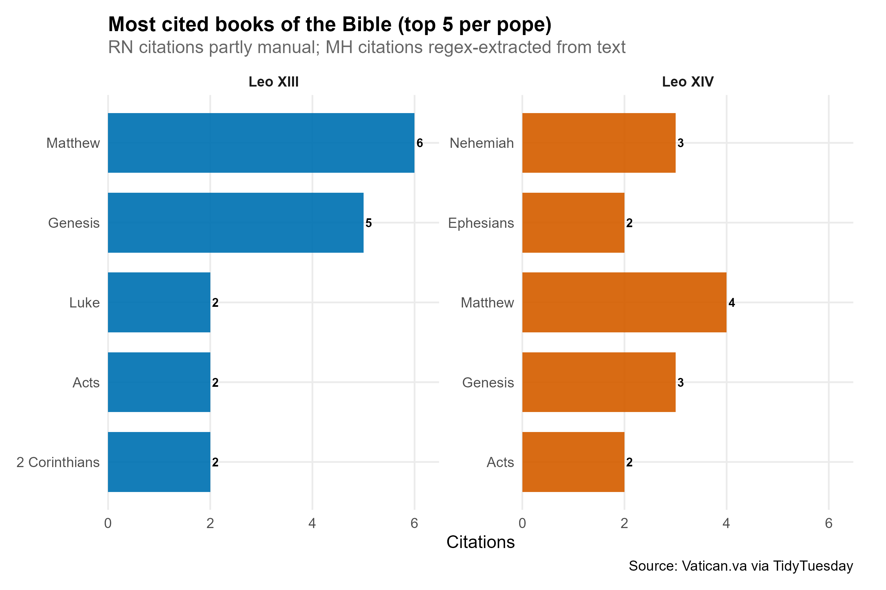
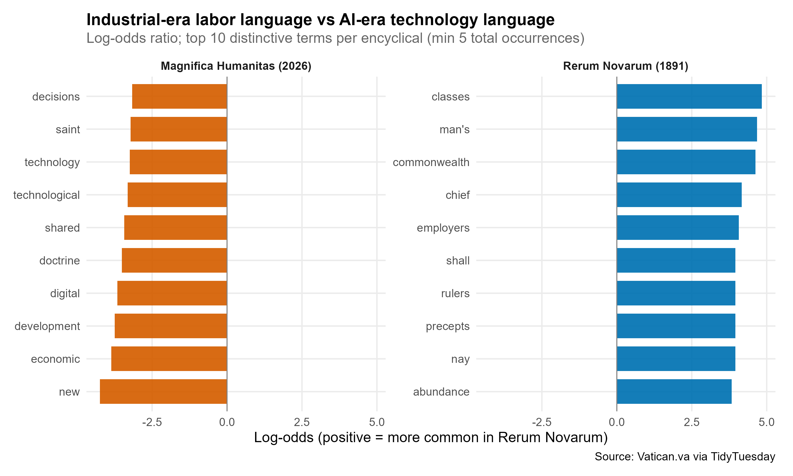
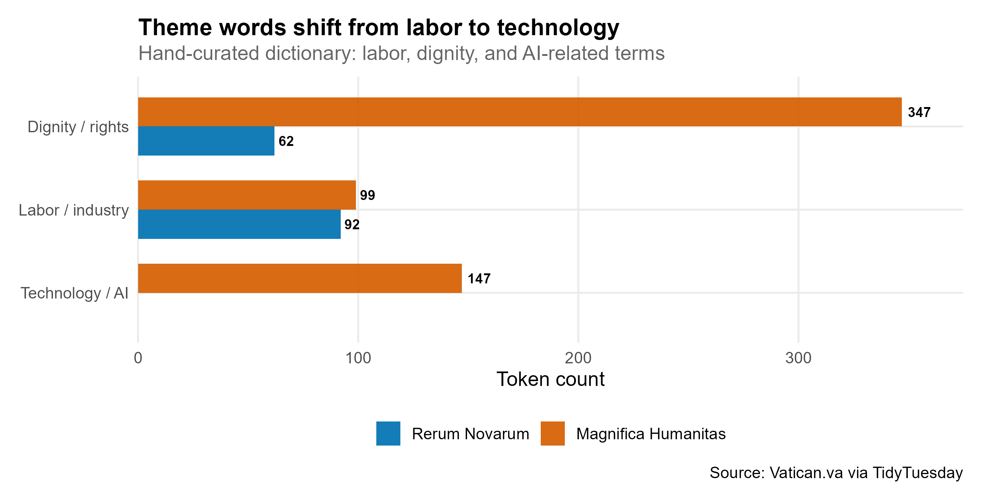
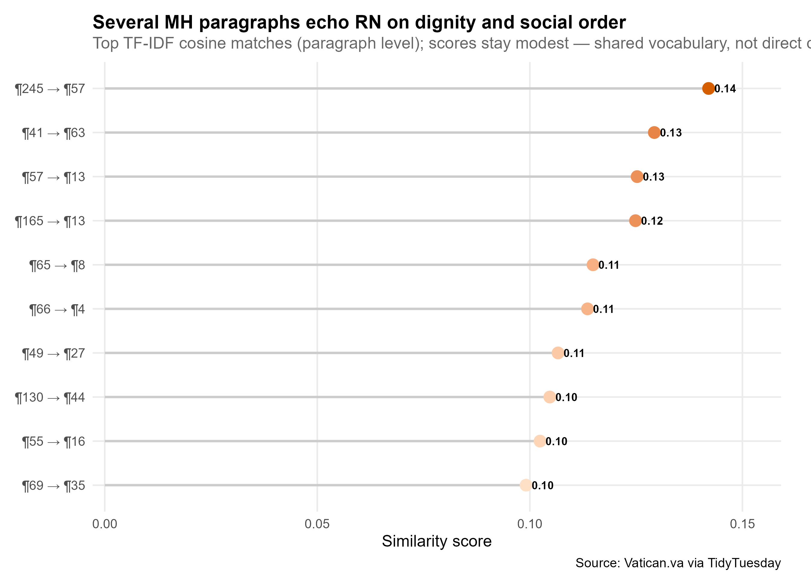
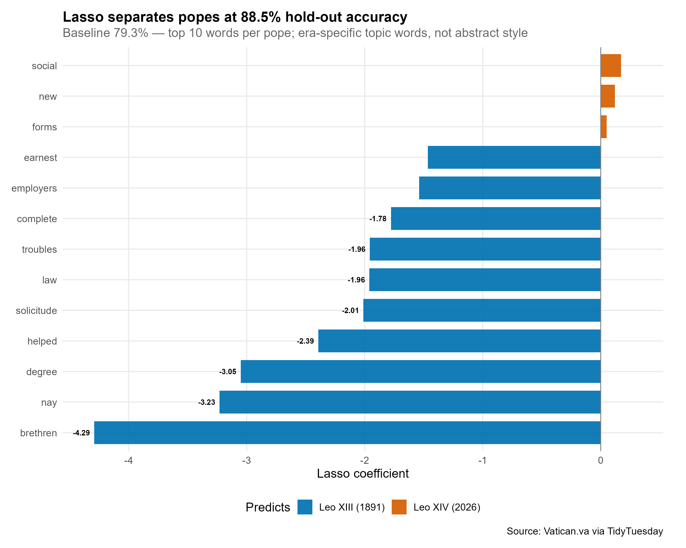

## Setup

```{r setup}
source("../install_packages.R")

library(tidyverse)
library(tidytext)

source("R/load_data.R")
source("R/01_encyclical_output.R")
source("R/02_scripture_emphasis.R")
source("R/03_vocabulary_evolution.R")
source("R/04_text_similarity.R")
source("R/05_pope_classifier.R")
source("R/save_plots.R")

dir.create("output", showWarnings = FALSE)

if (!file.exists("data/encyclicals.csv")) {
  download_data()
}

data <- load_encyclical_data()
encyclicals <- data$encyclicals
papal_encyclicals <- data$papal_encyclicals
scripture_references <- data$scripture_references
tokens <- tokenize_paragraphs(encyclicals)

results <- save_week_plots(
  papal_encyclicals,
  scripture_references,
  tokens,
  encyclicals
)
similarity <- results$similarity
classifier <- results$classifier
```

Data from [TidyTuesday 2026-06-23](https://github.com/rfordatascience/tidytuesday/tree/main/data/2026/2026-06-23): paragraph text from *Rerum Novarum* (1891) and *Magnifica Humanitas* (2026), a catalog of 213 papal encyclicals, and scripture citations extracted from both texts.

Charts below are the same static PNGs saved to `output/` by `run.R` — black value labels sit just outside each bar.

> "Humanity, created by God in all its grandeur, is today facing a pivotal choice: either to construct a new Tower of Babel or to build the city in which God and humanity dwell together." — Pope Leo XIV, *Magnifica Humanitas* §1

---

## Angle 1: Encyclical output over time

How has papal encyclical output changed from 1878 to 2026?

```{r output-time}

```

```{r output-pope}

```

```{r output-table}
summarise_encyclical_output(papal_encyclicals) |>
  head(10) |>
  knitr::kable(caption = "Encyclical counts by pope (top 10)")
```

**Takeaway:** Encyclical volume peaked in the late 19th and early 20th centuries — Leo XIII alone accounts for 86. Francis published only 4 in this catalog, reflecting a shift toward other forms of papal communication, not necessarily less teaching.

---

## Angle 2: Scripture emphasis

Which books of the Bible does each pope cite, and what does that reveal about theological emphasis?

```{r scripture-testament}

```

```{r scripture-books}

```

```{r scripture-table}
summarise_scripture(scripture_references) |>
  knitr::kable(caption = "Scripture citations by pope, testament, and book")
```

**Takeaway:** Leo XIII draws heavily on the New Testament (Matthew, Genesis, Corinthians) in *Rerum Novarum*. Leo XIV cites a broader mix including Old Testament prophets in *Magnifica Humanitas*. RN citations were partly manually mapped; MH citations were regex-extracted from the text.

---

## Angle 3: Vocabulary evolution

How does the vocabulary of Catholic Social Teaching evolve from the Industrial Revolution to the AI Revolution?

```{r vocabulary}

```

```{r theme-words}

```

```{r theme-words-table}
summarise_theme_words(tokens) |>
  knitr::kable(caption = "Theme word counts by encyclical")
```

**Takeaway:** *Rerum Novarum* is dominated by labor, property, and workers' rights language; *Magnifica Humanitas* brings in technology, digital, and intelligence. The log-odds chart highlights era-specific vocabulary more than shared social-doctrine terms.

---

## Angle 4: Textual lineage

Which passages of *Magnifica Humanitas* are most textually similar to *Rerum Novarum*?

```{r similarity}

```

```{r similarity-table}
summarise_text_similarity(similarity) |>
  knitr::kable(digits = 3, caption = "Top MH paragraphs by similarity to RN")
```

**Takeaway:** Several MH paragraphs show moderate TF-IDF similarity to RN sections on human dignity and social order — suggestive of intellectual lineage, not proof of direct quotation. Similarity is based on shared vocabulary, not semantic embeddings.

---

## Angle 5: Classify pope by paragraph

Can a model reliably distinguish which pope wrote a paragraph?

```{r classifier}

```

```{r classifier-table}
summarise_classifier(classifier) |>
  knitr::kable(digits = 3, caption = "Hold-out classifier performance")
```

**Takeaway:** A lasso logistic model on bag-of-words features often beats the 50% baseline on hold-out paragraphs. The chart shows the top words **per pope** on each side of zero — coefficients reflect topic words (labor vs technology), not abstract "style." With only two documents from different eras, treat this as exploratory.

---

- Hashtags: `#TidyTuesday` `#RStats` `#DataViz`
- Credit: [Vatican.va](https://www.vatican.va) via [TidyTuesday](https://tidytues.day); curated by Tony Galvan
