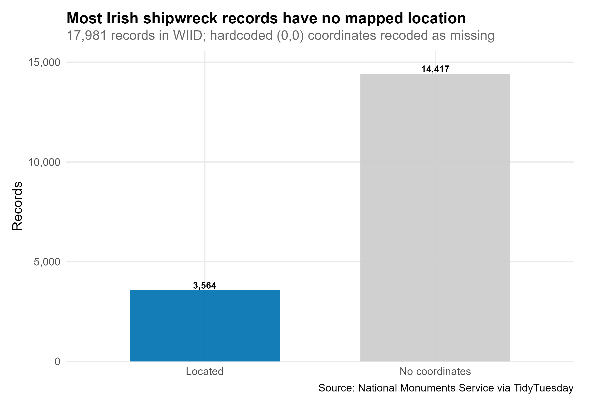
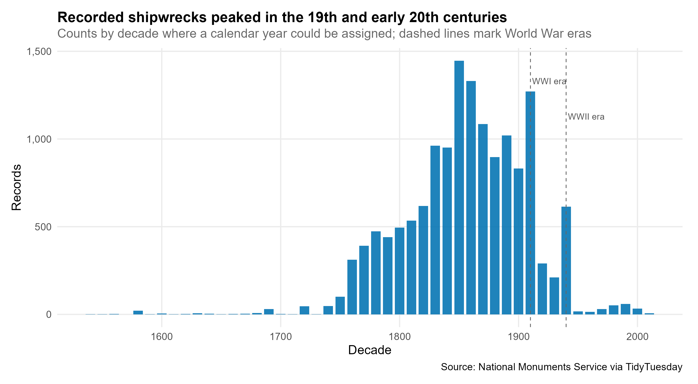
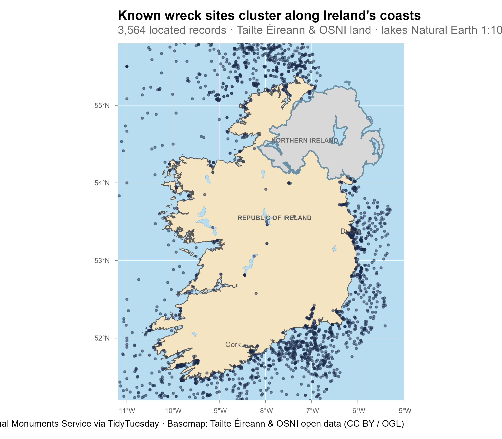
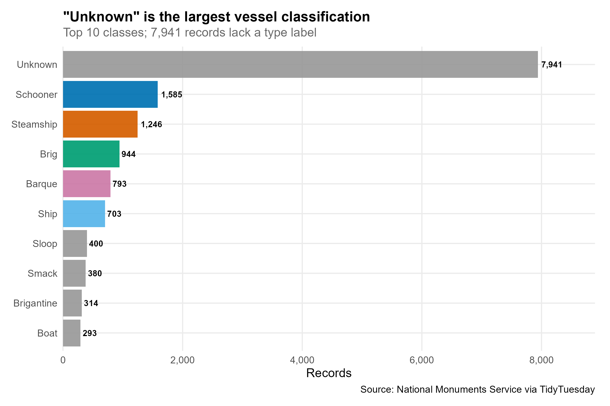

## Setup

```{r setup}
source("../install_packages.R")

library(tidyverse)

source("R/load_data.R")
source("R/01_location_status.R")
source("R/02_wrecks_over_time.R")
source("R/03_wreck_map.R")
source("R/04_classification.R")
source("R/save_plots.R")

dir.create("output", showWarnings = FALSE)

if (!file.exists("data/wreck_inventory.csv") ||
    !file.exists("data/ne_10m_lakes.geojson") ||
    !file.exists("data/osi_landmask.geojson") ||
    !file.exists("data/osni_outline.geojson")) {
  download_data()
}

wreck_inventory <- load_wreck_data()
results <- save_week_plots(wreck_inventory)
```

Data from [TidyTuesday 2026-06-30](https://github.com/rfordatascience/tidytuesday/tree/main/data/2026/2026-06-30): the [Wreck Inventory of Ireland Database (WIID)](https://www.archaeology.ie/advice-and-support/locate-a-monument-or-wreck/wreck-viewer/) — over 18,000 known and potential wreck records in Irish waters, curated by Cormac Monaghan.

Charts below are the static PNGs saved to `output/` by `run.R` — same files used for LinkedIn and slides.

> The Wreck Inventory of Ireland Database holds records of over 18,000 known and potential wreck sites in the marine and inland waterways of Ireland.

---

## Angle 1: Located vs unlocated

How many wreck records have coordinates — and how many are still unmapped?

```{r location}

```

```{r location-table}
summarise_location_status(wreck_inventory) |>
  knitr::kable(digits = 3, caption = "Records by coordinate status")
```

**Takeaway:** About **80%** of records lack usable coordinates (including hardcoded zeros recoded as missing). The dataset documents many wrecks whose location is not yet confirmed — matching the curator's note that unlocated wrecks are retained for research.

---

## Angle 2: Wrecks over time

When were shipwrecks most frequently recorded in the catalog?

```{r time}

```

```{r time-table}
summarise_wrecks_by_decade(wreck_inventory) |>
  dplyr::slice_max(n, n = 8) |>
  knitr::kable(caption = "Peak decades by record count")
```

**Takeaway:** Counts peak in the **1800s and 1910s**, with visible bumps around the World War eras. Older wrecks and approximate dates are common; treat the timeline as catalog coverage, not a complete historical census.

---

## Angle 3: Where wrecks cluster

Where are located wrecks concentrated around Ireland?

```{r map}

```

**Takeaway:** Mapped wrecks cluster along **Ireland's coasts and shipping lanes**. The basemap uses Tailte Éireann and OSNI open land outlines (cream Republic, grey Northern Ireland) with major lakes from Natural Earth 1:10m (including Lough Ree and Lough Derg). Only ~3,500 records (~20%) have coordinates.

---

## Angle 4: Vessel types

What kinds of vessels appear most often?

```{r class}

```

```{r class-table}
summarise_classifications(wreck_inventory) |>
  knitr::kable(caption = "Top 10 vessel classifications")
```

**Takeaway:** **Unknown** is the largest single class (~44% of records). Among labelled types, sailing-era vessels (schooner, brig, barque) dominate — consistent with the pre-1946 focus of much of the inventory.

---

- Hashtags: `#TidyTuesday` `#RStats` `#DataViz`
- Credit: [National Monuments Service](https://www.archaeology.ie/) via [TidyTuesday](https://tidytues.day); curated by Cormac Monaghan
