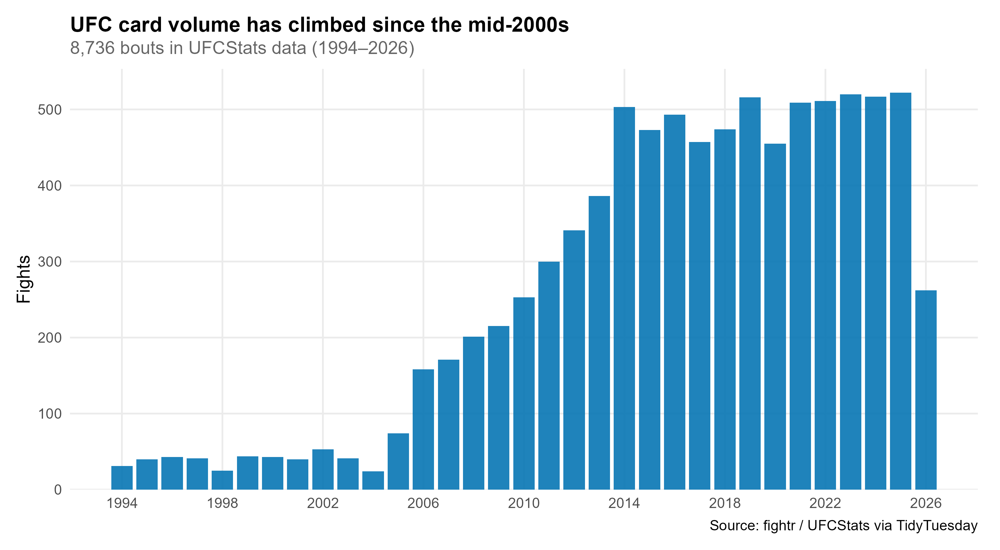
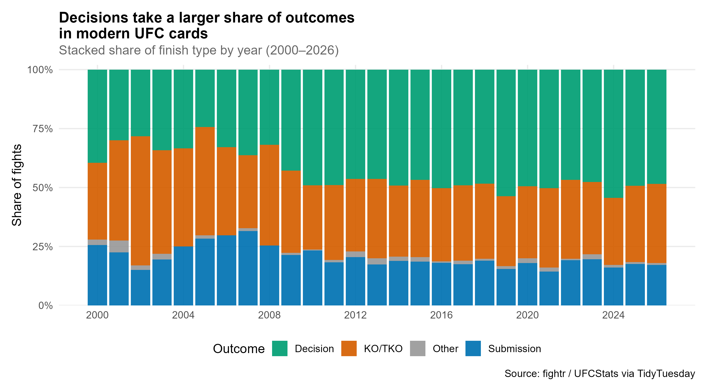
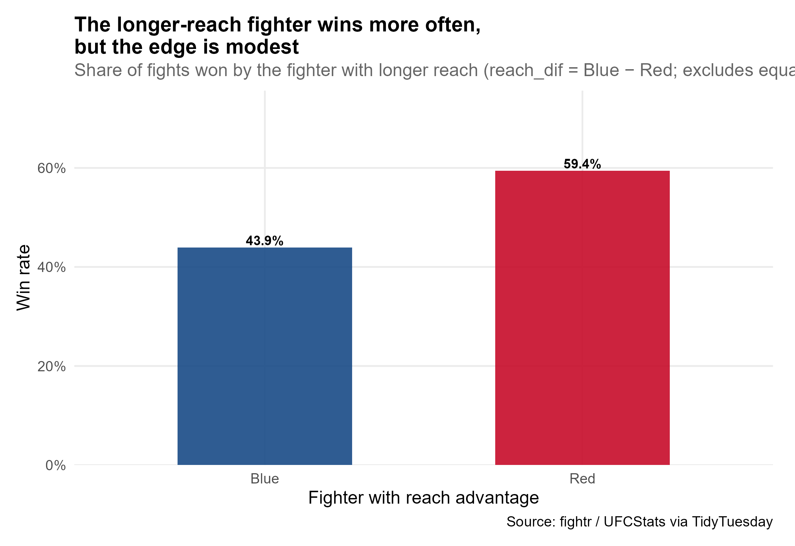
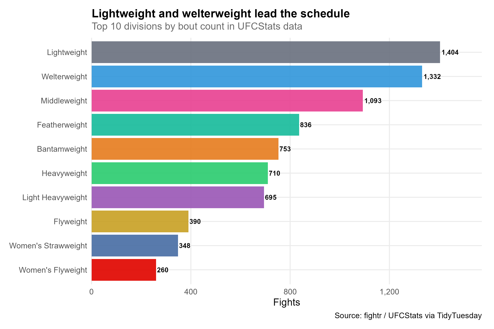

## Setup

```{r setup}
source("../install_packages.R")

library(tidyverse)

source("R/load_data.R")
source("R/01_fights_over_time.R")
source("R/02_finish_mix.R")
source("R/03_reach_advantage.R")
source("R/04_weight_classes.R")
source("R/save_plots.R")

dir.create("output", showWarnings = FALSE)

if (!file.exists("data/ufc_fights.csv") ||
    !file.exists("data/ultimate_ufc_dataset.csv")) {
  download_data()
}

fights <- load_fight_data()
ultimate <- load_ultimate_data()
results <- save_week_plots(fights, ultimate)

fig_dir <- "report-figures"
dir.create(fig_dir, recursive = TRUE, showWarnings = FALSE)
report_pngs <- list.files("output", pattern = "^0[1-4].*\\.png$", full.names = TRUE)
invisible(file.copy(report_pngs, file.path(fig_dir, basename(report_pngs)), overwrite = TRUE))
```

Data from [TidyTuesday 2026-07-07](https://github.com/rfordatascience/tidytuesday/tree/main/data/2026/2026-07-07): UFC bout and athlete records compiled in the [`{fightr}`](https://github.com/benyamindsmith/fightr) package — curated by Benjamin Smith.

Charts below embed static PNGs from `output/` (same files used for LinkedIn and slides). For filterable finish breakdowns — year, event, outcome, division, **Men / Women**, and **title fights** — with linked donuts and a searchable fight table (2020–2026), open the [interactive finish dashboard](output/_widget/finish_dashboard.html).

> The `fightr` package provides a comprehensive, historical dataset of Ultimate Fighting Championship (UFC) bouts and athlete-level profile information.

---

## Angle 1: Fights over time

How many UFC bouts are recorded each year?

```{r time}

```

```{r time-table}
summarise_fights_by_year(fights) |>
  dplyr::slice_tail(n = 8) |>
  knitr::kable(caption = "Recent years by bout count")
```

**Takeaway:** Card volume is **much higher in the 2010s–2020s** than in the promotion's early years. Early 1990s counts reflect a smaller schedule and incomplete historical capture in UFCStats.

---

## Angle 2: Finish mix

How have KO/TKO, submissions, and decisions shifted as a share of outcomes? The [interactive finish dashboard](output/_widget/finish_dashboard.html) lets you slice by year, event, division, gender, and title fights.

```{r finish}

```

```{r finish-table}
summarise_finish_by_year(fights) |>
  dplyr::filter(year >= 2020) |>
  dplyr::select(year, finish_type, n, share) |>
  knitr::kable(digits = 3, caption = "Finish type counts and shares (2020–2026)")
```

**Takeaway:** **Decisions** account for a growing share of results in recent years, while **KO/TKO** and **submissions** still make up a substantial minority. Treat as descriptive — rules, judging, and roster depth all changed over time.

---

## Angle 3: Reach advantage

When one fighter has longer reach, how often does that fighter win?

```{r reach}

```

```{r reach-table}
summarise_reach_advantage(ultimate) |>
  knitr::kable(digits = 3, caption = "Wins by fighter with reach advantage")
```

**Takeaway:** The **longer-reach fighter wins about 44–59%** of bouts where reach differs (`reach_dif` = Blue − Red in `ultimate_ufc_dataset`). Red-corner reach edges show a stronger association than Blue-corner edges in this sample — still far from deterministic.

---

## Angle 4: Weight classes

Which divisions appear most often on UFC cards?

```{r class}

```

```{r class-table}
summarise_weight_classes(fights) |>
  knitr::kable(caption = "Top 10 divisions by bout count")
```

```{r weight-scales}
weight_class_scales_table() |>
  knitr::kable(caption = "UFC division upper weight limits (lb)")
```

**Takeaway:** **Lightweight** and **Welterweight** lead the bout count, with **Middleweight** and **Featherweight** close behind — consistent with the UFC's traditional depth in the 155–170 lb range.

---

- Hashtags: `#TidyTuesday` `#RStats` `#DataViz`
- Credit: [`{fightr}`](https://github.com/benyamindsmith/fightr) / Benjamin Smith via [TidyTuesday](https://tidytues.day)
